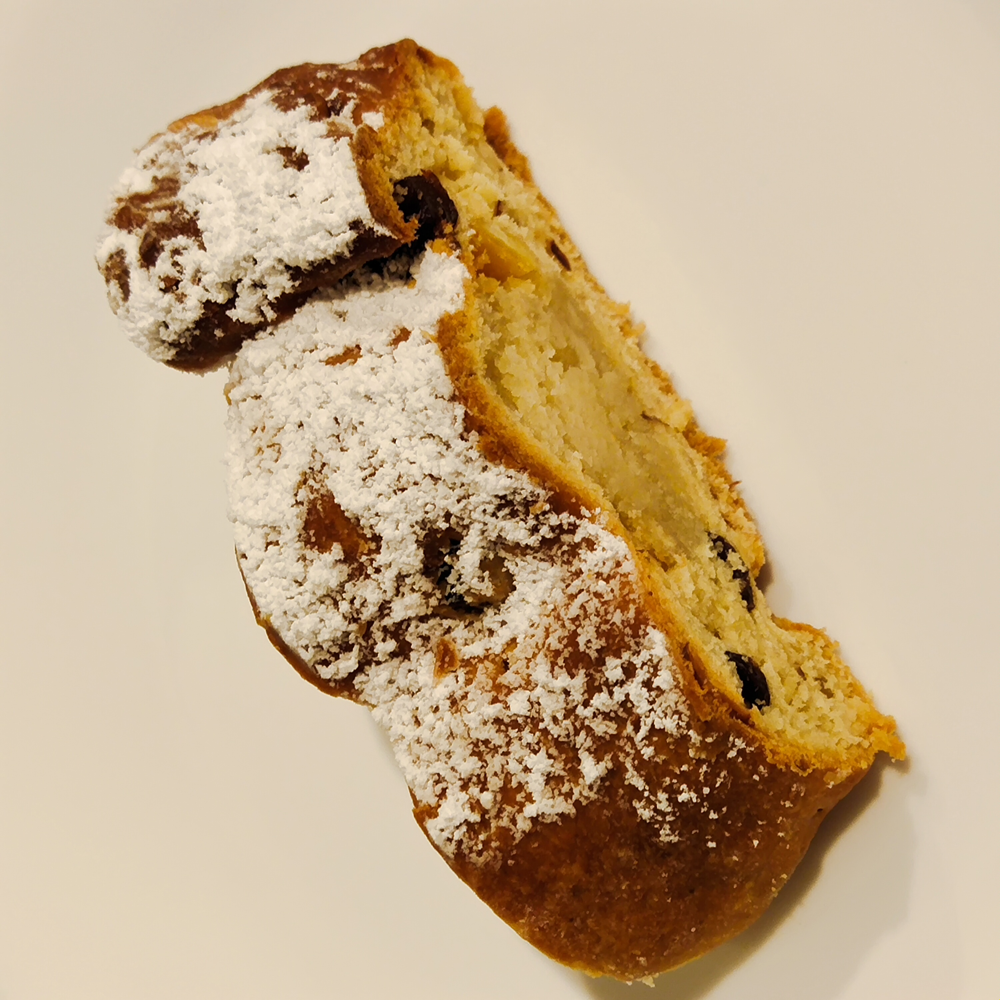

[Back to homepage](https://ah-jia.github.io/)

# STOLLEN GERMAN CHRISTMAS BREAD

## Dough
### Ingredients
- 1 cup lukewarm whole milk
- 3 tsp active dry yeast
- 100 gm sugar
- 520 gm plain flour
- 1 egg + 2 egg yolks
- 170 gm butter,softened
- 2 tsp pure vanilla extract
- zest of 1 lemon
- 1 tsp salt
- 3/4 tsp ground cardamom
- 3/4 tsp ground nutmeg
- 1/2 tsp ground cinnamon

## Fruits & Nuts
- 250 gm black raisins
- 170 gm mixed peel
- 80 gm sliced almonds
- 1/3 cup rum or brandy

Soak the fruits in the rum or brandy for a few days

## Glazing & Dusting
- 100 gm butter, melted
- powdered sugar for gfenerous dusting

### Steps
1. Stir the yeast and 2 tbsp of sugar into the milk and let it sit in a warm place for 10-15 minutes until very frothy.
2. Place the flour, remaining sugar, egg + 2 egg yolks, softened butter, vanilla extract, lemon zest, salt, cardamon, nutmeg,and cinnamon in the bowl of a stand mixer fitted with a dough hook. Add the yeast/milk mixture.  Use speed 2 (if using Kenwood) to knead the dough for 7-8 minutes until a dough is formed. Remove the dough ball, lightly oil the bowl, return the dough ball, cover with plastic wrap and place it in a warm place or lightly warmed oven, to rise until nearly doubled in size, at least 1 hour.
3. Punch down the dough and add the saoked fruit and sliced almonds to the dough.  Using the dough hook, knead the fruit/almond mixture into the dough until combined.  If the dough is too wet to handle, add a little bit of flour until the dough pulls away from the sides of the bowl.
4. Turn the dough out onto a floured work surface and cut into 3 equal portions (or 6 smaller portions if preferred).  Roll out each portion into an oval to about 1 inch thickness.  Roll each piece of marzipan into a log the length of the oval.  Press the marzipan gently into the middle of the dough.  Fold the left side of the dough over to cover the marzipan, then fold the right side over on top of the left side so that the edge of it sits just left of the middle of the stollen.  In other words, don't fold the right side all the way over to the left edge of the stollen.  Pinch and tuck the top and bottom ends of the stollen to cover the marzipan. Use the bottom edge of your hand to press down along the length of the stollen towards right of the center to create a divot and characteristic hump.
5. Place the stollen on a lined baking sheet.  Cover the stollen loosely with plastic wrap and let them rest in a warm place or lightly warmed oven for 40-60 minutes until puffy.  At that point you  can pick any raisins that are sticking out of the dough (they will burn during baking).
6. Towards the end of the last rise, preheat the oven to 175 deg C and bake the stollen for 30-40 minutes or until golden.  Let the stollen sit for 5 minutes, then use a toothpick to poke holes all over the stollen (this will allow the butter to seep in), then generously brush the stollen with the melted butter while the stollen is still warm.  Immediately sprinkle with a generous amount of powdered sugar, rubbing it into the creases and down the sides.  Let the stollen cool completely.  You may want to give it another dusting of powdered sugar once cooled.
7. The stollen can be sliced and eaten now or wrapped tightly (wrap in plastic wrap then foil) and left to "ripen" in a cool place for 2 weeks.  (recommended in the fridge) The liquid from the dried fruits will further penetrate the dough for more flavor and moisture.  
8. For eating, it is recomended to warm the sliced up stollen for 20-30 seconds in the microwave, it makes the crumb nice and soft.

# HOMEMADE MARZIPAN OR ALMOND PASTE

## Ingredients
- 1 1/2 cups superfine ground blanched almond flour
- 1 1/2 cups powdered sugar
- 2 tsp quality pure almond extract
- 1 tsp quality food grade rose water
- 1 egg white

### Steps

1. Place the almond flour and powdered sugar in a food processor and pulse until combined (not lumpy).  Add the almond extract and rose water and pulse to combine.  Add the egg white and process until a thick dough is formed
2. Turn the marzipan onto a work surface and knead it a few times.  Form it into a log (cut into 3 or 6 portions acording to your choice of dough portions), wrap it up in plastic wrap and refrigerate till needed.

[Back to homepage](https://ah-jia.github.io/)
